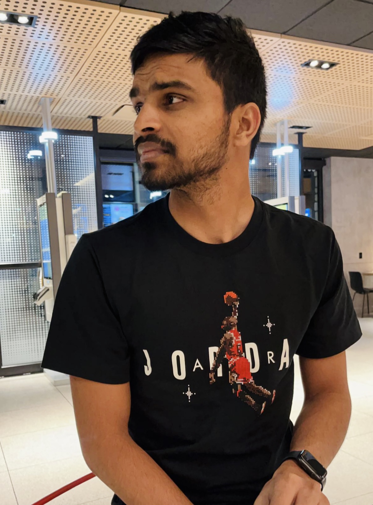

# Pramod Reddy Gonegari

  

## Current: 
- I am a Computer Science Graduate Student and this is my final semester.

## Background: 
- I had pursued my Bachelors in Information Technology, back in Hyderabad, India. I am experienced in developing Full Stack Applications and had developed some interesting applications from scratch which you can find in my github. I also like to play cricket and watch movies.

## Plans:
- Developing Web and Mobile Applications excites me the most and also love working on good User Interfaces. I would like to work in a Company that gives me the ability to impact lives of people in a better way, using my programming skills.

## Links:
- [Github](https://github.com/pramod096)
